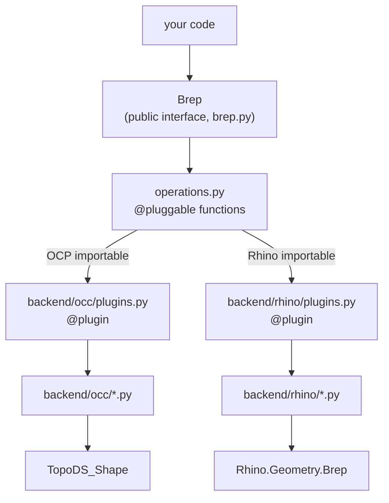

# Architecture

`Brep` is a thin public interface. It holds a reference to a **native
object** — the backend's own Brep representation — and owns no geometry
logic itself. Every method delegates to whichever backend is active.

## Backend dispatch

Dispatch uses [COMPAS's plugin system](https://compas.dev/compas/latest/tutorial/plugins.html).
Every operation is declared once as a `@pluggable` function in
[operations.py](https://github.com/gramaziokohler/compas_brep/blob/main/src/compas_brep/operations.py) —
just a signature, no implementation. Each backend registers a `@plugin`
implementation, gated by what's importable:

- **OCC** activates when `OCP` (`cadquery-ocp-novtk`) is importable.
- **Rhino** activates when `Rhino` is importable (`rhinoinside`, or running inside Rhino/Grasshopper).

Calling `brep.fillet(...)` calls the `brep_fillet` pluggable, and COMPAS
routes it to whichever `@plugin` is active. Nothing in `Brep`, and nothing in
your code, knows or cares which one that is.

## Topology objects

[`BrepVertex`](reference/compas_brep.vertex.md), `BrepEdge`, `BrepLoop`,
`BrepFace`, `BrepTrim` (see [What is a Brep?](brep-basics.md)) are thin
wrappers around a native handle, not data containers. A property like
`BrepFace.surface` calls into the native kernel on first access and caches
the result — it doesn't copy geometry out eagerly.

`NurbsCurve` and `NurbsSurface` are the exception: plain Python value types
(control points, knots, weights) with no backend dependency, used as the
return type for curve/surface properties.

## Exchange format

A Brep is only ever alive inside one backend process. Moving one across a
process boundary — Grasshopper to CI, OCC to Rhino — happens through a
STEP-inspired JSON **exchange document**, produced by `Brep.__data__` /
`Brep.__from_data__`. It encodes the same entities STEP does (vertices,
edges with curves, faces with surfaces, loops with trims) but as COMPAS
JSON. See [ADR-0001](https://github.com/gramaziokohler/compas_brep/blob/main/.agents/adr/0001-native-json-brep-exchange.md)
for the reasoning.

`Brep.to_step` / `Brep.from_step` are separate — for interop with
third-party CAD tools, not for moving between the two backends.
