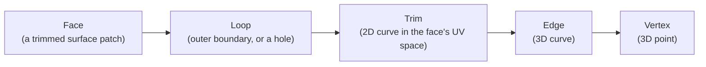

# What is a Brep?

A **Brep** (boundary representation) describes a 3D shape by its *boundary* —
the surfaces, curves, and points that enclose it. Not a mesh of triangles,
not a grid of voxels.

Take a cube. A mesh stores a pile of flat triangles that approximate its six
faces. A Brep stores six exact, flat surfaces, meeting at sharp edges. That's
why Breps stay exact through fillets, booleans, and zoom — there's no
faceting to notice.

## Building blocks

A Brep is built bottom-up from five kinds of entities:

| Entity | What it is |
|---|---|
| **Vertex** | A 3D point. |
| **Edge** | A 3D curve (line, arc, NURBS, ...), bounded by two vertices. |
| **Trim** | The 2D curve an edge traces in a face's parameter space ("UV" space). |
| **Loop** | A closed ring of trims: the *outer* boundary of a face, or an *inner* one that cuts a hole. |
| **Face** | A trimmed patch of a surface (plane, cylinder, NURBS, ...), bounded by one outer loop and zero or more inner loops. |

A `Brep` is the set of faces — plus the edges and vertices they share — that
together enclose, or partially bound, a shape.

In `compas_brep`, these map directly onto [`BrepVertex`](reference/compas_brep.vertex.md),
[`BrepEdge`](reference/compas_brep.edge.md), [`BrepLoop`](reference/compas_brep.loop.md),
[`BrepFace`](reference/compas_brep.face.md), and [`BrepTrim`](reference/compas_brep.trim.md).

## Further reading

- [Wikipedia: Boundary representation](https://en.wikipedia.org/wiki/Boundary_representation) — the general concept.
- [Open CASCADE modeling data](https://dev.opencascade.org/doc/overview/html/occt_user_guides__modeling_data.html) — the topology model this package builds on.
- [compas.geometry](https://compas.dev/compas/latest/api/compas.geometry.html) — the point/curve/surface types used throughout `compas_brep`.
