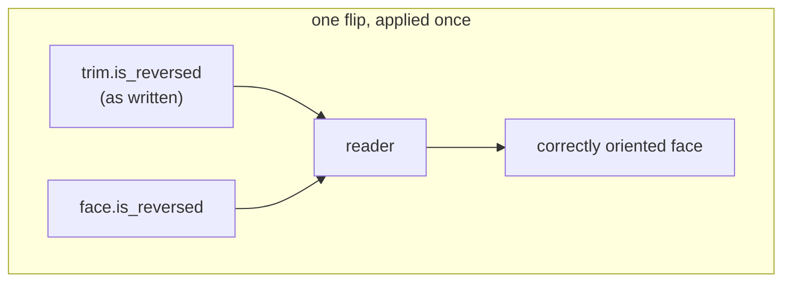
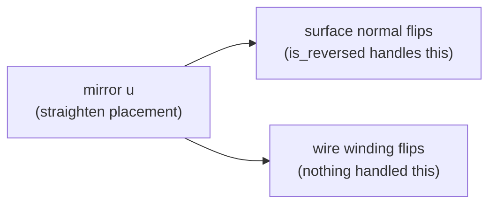
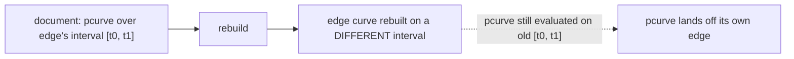
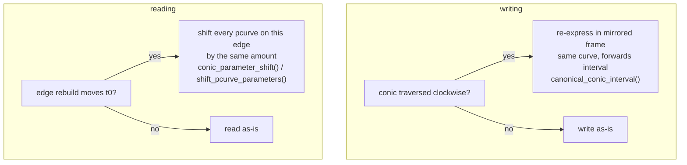
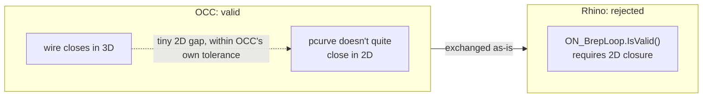
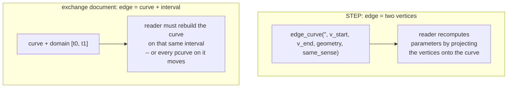

# Cross-backend exchange gaps

Rhino and OCC agree on Brep *topology* (vertices, edges, faces, loops, trims) but
disagree on the low-level rules each kernel enforces when rebuilding one from the
[exchange document](https://github.com/gramaziokohler/compas_brep/blob/main/.agents/adr/0001-native-json-brep-exchange.md).
This page catalogs the gaps found so far, one per kernel disagreement, with what
compas_brep does about each.

In every case the document leaves some detail unstated, the two kernels default
to different answers, and a document written by one and read by the other lands
on the wrong side of that default.

## Orientation is applied once, in the trim's own space

A face's `is_reversed` flag says its stored surface faces the wrong way. A trim's
`is_reversed` flag says it runs against its edge. The document defines both **in
the face's own, unflipped parameter space**. A reader applies `is_reversed` to
the *face* and reads every trim as-is, once.



Both backends had a writer or a reader that composed the two flags together,
applying the same orientation twice:

- **OCC writer.** Explored a face's wires *through* the face itself. A `REVERSED`
  face composes its flag into every trim OCC hands back, so the writer recorded
  already-composed values. Fixed by exploring a `FORWARD`-oriented copy of the
  face instead: [`conversion.py:804`](https://github.com/gramaziokohler/compas_brep/blob/main/src/compas_brep/backend/occ/conversion.py#L804).
- **Rhino reader.** Reversed the trim loop *and* XOR'd every trim against
  `face.is_reversed` before calling `Trims.Add`, on top of `add_face` already
  setting `OrientationIsReversed`. Fixed by reading trims exactly as the document
  gives them: [`conversion.py:1217`](https://github.com/gramaziokohler/compas_brep/blob/main/src/compas_brep/backend/rhino/conversion.py#L1217).

**Symptom:** a blind hole round-tripped into a bump. Volume went *up* instead of
down (981.9 → 1018.1), because a reversed cylinder wall came back inside out. The
number looks plausible, so a tolerance check on volume passes. Only `is_valid`
(Rhino) or `BRepCheck_Analyzer` (OCC) catches it.

**Status:** fixed on both backends.

## A mirrored surface reverses the wire, not just the normal

OCC gives some rebuilt analytic surfaces (cylinder, sphere, cone, torus) a
left-handed placement. Straightening it mirrors the surface's `u`, which reverses
the *winding* of every loop on it, not just the surface normal.



The code absorbed the normal flip into `is_reversed` but never turned the wire
around to match. The loop then wound clockwise in the mirrored space, bounding
the *outside* of the patch.

**Symptom:** every corner patch of a filleted box rebuilt inside out, reported as
a negative face area and `BRepCheck_BadOrientationOfSubshape`. The volume still
integrated to the right number, since integration over the wrong-signed side of a
*closed* patch still converges. It sat in the suite as a
[known `xfail`](https://github.com/gramaziokohler/compas_brep/blob/main/tests/test_exchange_fixtures.py)
rather than a bug.

**Status:** fixed. The wire is reversed and every trim's `is_reversed` flipped
alongside the normal correction:
[`conversion.py:850`](https://github.com/gramaziokohler/compas_brep/blob/main/src/compas_brep/backend/occ/conversion.py#L850).

## A pcurve is only valid on its edge's own interval

The document writes a trim's 2D pcurve over its **edge curve's** parameter
interval. If a rebuild reparameterizes that curve, by moving where `t=0` sits or
how far it runs, the pcurve is then evaluated at parameters the curve no longer
answers to.



Three kernel behaviors reparameterize an edge without telling the caller:

| Curve | Rebuild moves it to | Reference |
|---|---|---|
| `line` | `[0, length]`, since a line stores only its endpoints | [`exchange.py`](https://github.com/gramaziokohler/compas_brep/blob/main/src/compas_brep/exchange.py) |
| periodic conic (`circle`, `ellipse`) | `[0, 2π)`. [`BRepBuilderAPI_MakeEdge`](https://dev.opencascade.org/doc/refman/html/class_b_rep_builder_a_p_i___make_edge.html) discards whole turns without reporting it | [`conic_parameter_shift`](https://github.com/gramaziokohler/compas_brep/blob/main/src/compas_brep/exchange.py#L254) |
| conic with a **decreasing** interval | rejected outright, since a NURBS knot vector cannot decrease | [`canonical_conic_interval`](https://github.com/gramaziokohler/compas_brep/blob/main/src/compas_brep/exchange.py#L216) |

**Symptoms, by row:**

1. A boolean leaves a cylinder's seam on e.g. `[5, 15]`; the reader rebuilds the
   line over `[0, 10]`. The seam's pcurve sits `t0` away from its own edge, which
   gives `BRepCheck_InvalidRange`, an unorientable face, and a broken wire on
   every full-turn cylindrical face surviving a boolean.
2. An OCC ellipse handed over on `[6.96, 11.00]` (past one turn) comes back on
   `[0.67, 4.71]`. The old pcurve is evaluated by extrapolation. Worst observed
   gap was over **1.7** units on a curve of radius ~1.
3. Rhino reports a scaled cylinder's elliptical rim running *clockwise*:
   `[π/2, −3π/2]`. Written straight out that produces a **decreasing** NURBS knot
   vector, which is not a backwards curve but an unbuildable one. OCC rejects the
   whole document: `BSpline curve: Knots interval values too close`.

**Status:** fixed for all three. The rule is stated once: an edge's interval
always **increases**, and a writer or reader that reparameterizes an edge shifts
every pcurve on it by the same amount.



Row 3 is fixed by re-expressing the conic in a mirrored frame rather than
reversing the edge, which would strand every trim's `is_reversed`:

```
centre + a·cos(−t)·x + b·sin(−t)·(−y)  ==  centre + a·cos(t)·x + b·sin(t)·y
```

Same points, same direction of travel; only the frame and the interval turn
around. Verified to `0.000` deviation over the edge in
[`test_exchange_reversed_faces.py`](https://github.com/gramaziokohler/compas_brep/blob/main/tests/test_exchange_reversed_faces.py).

## Rhino tolerates pcurve drift, OCC does not

To Rhino a pcurve is an *approximation*, accurate to the trim's own stated
tolerance, with the 3D edge curve as ground truth. OCC requires the two to agree
within the edge's tolerance and asserts it explicitly
([`SameParameter`](https://dev.opencascade.org/doc/refman/html/class_b_rep_lib.html)).
A document that does not hold that agreement produces a shape OCC itself calls
invalid.

A straight (degree-1) pcurve for a `circle` or `arc` edge is exact only when the
surface's own `u` is linear in angle, which holds for OCC's analytic cylinder.
Rotate that cylinder in Rhino and the wall degrades to a rational NURBS whose `u`
is not linear in angle. The straight pcurve then misses its own circular edge by
~2×10⁻² against a tolerance of 10⁻⁶, four orders of magnitude out. It still
agrees at span endpoints and midpoints, which is why sampling at regular
intervals misses it.

**Symptom:** the cutter Brep was invalid the moment OCC read it. The boolean ran
against it anyway and returned a result whose damage surfaced two process-hops
later, in Rhino, as an unrelated-looking `Brep reconstruction failed`.

**Status:** fixed. Every OCC rebuild now calls
[`BRepLib.SameParameter_s`](https://github.com/gramaziokohler/compas_brep/blob/main/src/compas_brep/backend/occ/conversion.py#L995),
the reconciliation every OCC importer runs on foreign geometry, then checks
`BRepCheck_Analyzer` and **raises `BrepInvalidError` if the kernel still calls
its own rebuild invalid**:
[`conversion.py:1004`](https://github.com/gramaziokohler/compas_brep/blob/main/src/compas_brep/backend/occ/conversion.py#L1004).

compas_brep performs no geometry of its own; it asks a kernel to build one. When
the kernel hands back something it will not call valid, that is where to stop,
not at the next operation that trips over it. Before this check, a boolean that
consumed a broken operand and returned a broken result was indistinguishable
from one that worked.

## Not handled: 3D wire closure vs. 2D loop closure

OCC's own boolean operations can produce a face whose wire closes correctly in
**3D** but whose trims leave a small gap in **2D** parameter space (observed:
~5×10⁻⁷, itself within OCC's own tolerance). OCC calls this valid. Rhino's
`ON_BrepLoop::IsValid` requires trims to close in 2D and rejects it.



The two kernels disagree about what counts as valid. Neither writer is at fault.
Tried and rejected:

- `Brep.Repair()` in the Rhino builder closes the gap, but **masks real
  corruption** too. A cylinder whose axis was deliberately displaced by 3 units
  still "successfully" rebuilds under `Repair`. compas_brep raises on an invalid
  rebuild everywhere else, so repairing silently here would be inconsistent.
- Rhino's declared trim and edge tolerances make no difference. The 2D check in
  `ON_Brep::IsValid` is not tolerance-driven.
- OCC's own [`ShapeFix_Wire::FixGaps2d`](https://dev.opencascade.org/doc/refman/html/class_shape_fix___wire.html)
  reports touching the wire but does not close a gap that small, since OCC
  considers it within tolerance already.

**Status:** unresolved. The Rhino rebuild fails with `Brep reconstruction
failed!` naming the bad loop, so it is visible rather than silent. Closing the
gap would mean compas_brep doing geometry work neither kernel considers
necessary.

## Why not just use STEP?

STEP already round-trips Breps between both kernels (`Brep.to_step` /
`Brep.from_step`), and most of the gaps above cannot occur in it.

Measured against the entities OCC writes for a box with a cylindrical channel:

| Gap above | In STEP? | Why |
|---|---|---|
| Orientation applied twice | possible | Same layered flags: [`advanced_face`](http://www.steptools.com/stds/step/IR_final/part42/)`.same_sense`, `oriented_edge.orientation`, `edge_curve.same_sense`. Same ambiguity, but ISO 10303 pins how they compose, and you inherit a mature translator's reading instead of writing one. |
| Mirrored `u` | **impossible** | `axis2_placement_3d` stores only `axis` and `ref_direction`; y is derived as their cross product, so a placement is right-handed by construction. The kernel does the mirror when writing. |
| Pcurve interval reparameterized | **impossible** | STEP writes **no parameter intervals on edges**. See below. |
| Pcurve drift (`SameParameter`) | same problem, but named | STEP carries pcurves and declares which representation wins: `surface_curve('',#27,(#31,#43),.PCURVE_S1.)`. A reader knows what to trust and what to recompute. |
| 3D vs 2D loop closure | not addressed | A kernel-validity question, not a format one. STEP declares a global tolerance (`uncertainty_measure_with_unit(1.E-07)`) but does not mandate 2D closure. |

STEP delimits an edge by its **vertices**, never by a parameter range. A STEP
file for the shape above contains zero `trimmed_curve` entities:



The family of bugs in the previous section cannot be expressed in STEP at all.
Two more measurements, both in STEP's favour:

- **Analytic surfaces survive.** The channel came back as
  `{Plane: 6, CylindricalSurface: 1}`, not a NURBS approximation.
- **Tolerances survive better than ours.** Source `1e-7 .. 1e-7`, after STEP
  `1e-7 .. 1e-7`, after a compas_brep JSON round-trip `1e-7 .. 1e-6`. Our rebuild
  loosens one edge tenfold; STEP's did not.

### Why the JSON document is still the exchange path

1. **Rhino's STEP import needs the UI thread and opens a modal dialog.** It goes
   through `RhinoDoc.ActiveDoc.ReadFile`
   ([`backend/rhino/io.py`](https://github.com/gramaziokohler/compas_brep/blob/main/src/compas_brep/backend/rhino/io.py)).
   Anything headless, such as a worker, a solver loop, or a Grasshopper component
   ticking on a timer, blocks on a dialog nobody is there to dismiss.
2. **Translators heal on import, which hides problems.** STEP readers run repair
   pipelines, and [OCC's STEP translator](https://dev.opencascade.org/doc/overview/html/occt_user_guides__step.html)
   is explicit about this. Errors become silent geometry changes, the opposite of
   failing where the problem was caused. The `BrepInvalidError` this package
   raises on an invalid rebuild would never fire.
3. **You control neither the fidelity nor the failure modes.** You would be
   debugging two translators you do not own instead of one format you do. This is
   [ADR-0001](https://github.com/gramaziokohler/compas_brep/blob/main/.agents/adr/0001-native-json-brep-exchange.md)'s
   original argument and it still holds.

!!! note "Scope of these measurements"

    The OCC→STEP→OCC figures above are measured. The claims about Rhino's STEP
    *import* come from reading that code path and from the dialog it opens, not
    from measured geometry. That dialog is what makes the round trip hard to
    automate in the first place.

`to_step` and `from_step` stay as they are: for exchanging geometry with
third-party CAD, interactively, where a dialog is fine and a translator's healing
is welcome.
