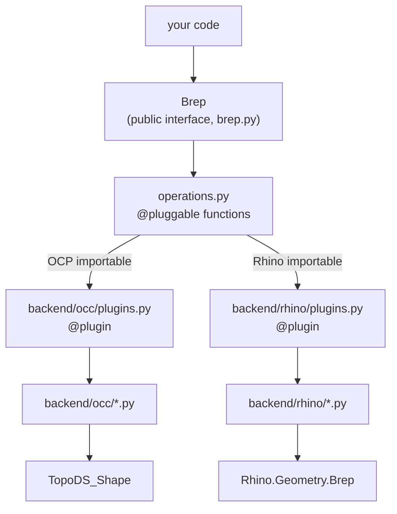

# COMPAS Brep

<p class="lead">
A unified, pip-installable Brep wrapper for the <a href="https://compas.dev">COMPAS</a> framework,
with pluggable OpenCASCADE (OCC) and Rhino backends.
</p>

## Installation

```bash
pip install compas-brep
```

With OCC support (Python ≥ 3.10):

```bash
pip install "compas-brep[occ]"
```

## Quick start

```python
from compas_brep import Brep

# Create a box
box = Brep.from_box(1.0, 2.0, 3.0)

# Inspect topology
print(len(box.faces))    # 6
print(len(box.edges))    # 12
print(len(box.vertices)) # 8

# Serialise / deserialise
data = box.to_data()
restored = Brep.from_data(data)
```

## How it works

`Brep` is a thin public interface. Every call is dispatched, at runtime, to
whichever backend is actually available — no code branches on OCC vs. Rhino.



See [Architecture](architecture.md) for the full picture, and
[Motivation](motivation.md) for why it's built this way.

## Documentation

For full instructions, a tutorial, examples, and an API reference,
see the sections linked in the navigation.

## Issue Tracker

If you find a bug or have a problem running the code, please file an issue on the
[Issue Tracker](https://github.com/gramaziokohler/compas_brep/issues).
